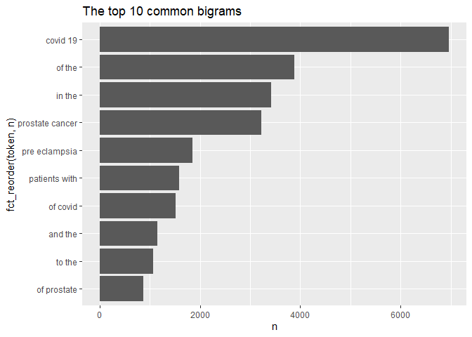
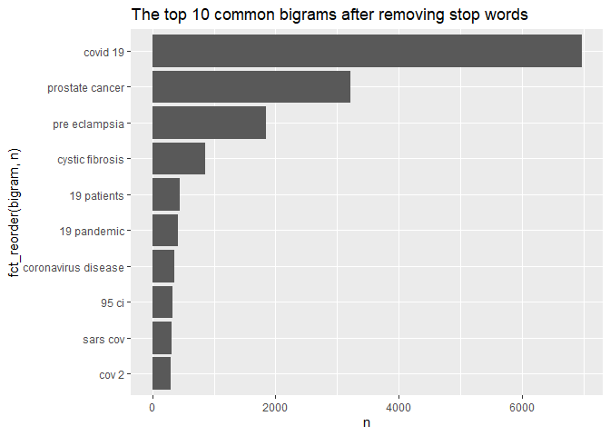

HW3
================
Lin Wang
10/10/2020

You can view the report
[here](https://ghcdn.rawgit.org/HopeW233/Pm566HW/master/HW3/README.html)

``` r
knitr::opts_chunk$set(include  = TRUE)
library(httr)
library(xml2)
library(stringr)
library(readr)
library(tidytext)
library(dplyr)
```

    ## 
    ## Attaching package: 'dplyr'

    ## The following objects are masked from 'package:stats':
    ## 
    ##     filter, lag

    ## The following objects are masked from 'package:base':
    ## 
    ##     intersect, setdiff, setequal, union

``` r
library(tidyverse)
```

    ## -- Attaching packages ------------------------------------------- tidyverse 1.3.0 --

    ## v ggplot2 3.3.2     v purrr   0.3.4
    ## v tibble  3.0.3     v forcats 0.5.0
    ## v tidyr   1.1.1

    ## -- Conflicts ---------------------------------------------- tidyverse_conflicts() --
    ## x dplyr::filter() masks stats::filter()
    ## x dplyr::lag()    masks stats::lag()

``` r
library(ggplot2)
```

## APIs

1.  Using the NCBI API, look for papers that show up under the term
    “sars-cov-2 trial vaccine.” Look for the data in the pubmed
    database, and then retrieve the details of the paper as shown in lab
    7. How many papers were you able to find?

<!-- end list -->

``` r
# Downloading the website
website <- xml2::read_html("https://pubmed.ncbi.nlm.nih.gov/?term=sars-cov-2+trial+vaccine")

# Finding the counts
counts <- xml2::xml_find_first(website, "/html/body/main/div[9]/div[2]/div[2]/div[1]/span")
counts
```

    ## {html_node}
    ## <span class="value">

``` r
# Turning it into text
counts <- as.character(counts)

# Extracting the data using regex
stringr::str_extract(counts, "[0-9,]+")
```

    ## [1] "560"

  - There are 560 papers related the term “sars-cov-2 trial
    vaccine”(10/13/2020).

<!-- end list -->

2.  Using the list of pubmed ids you retrieved, download each papers’
    details using the query parameter rettype = abstract. If you get
    more than 250 ids, just keep the first 250.

<!-- end list -->

``` r
# Find paper ids under the term
query_ids <- GET(
  url   = "https://eutils.ncbi.nlm.nih.gov/entrez/eutils/esearch.fcgi",
  query = list(
    db="pubmed",
    term="sars-cov-2 trial vaccine",
    retmax=1000)
)
# Extracting the content of the response of GET
ids <- httr::content(query_ids)

# Turn the result into a character vector
ids <- as.character(ids)

# Find all the ids 
ids <- stringr::str_extract_all(ids, "<Id>[0-9]+</Id>")[[1]]

# Remove all the leading and trailing <Id> </Id>. Make use of "|"
ids <- stringr::str_remove_all(ids, "<Id>|</Id>") # "</?Id>"

# Now we have 225 ids
publications <- GET(
  url   = "https://eutils.ncbi.nlm.nih.gov/entrez/eutils/efetch.fcgi",
  query = list(
    db="pubmed",
    id=paste(ids, collapse=","),
    retmax=1000,
    rettype="abstract"
    )
)
# Turning the output into character vector
publications <- httr::content(publications)
publications_txt <- as.character(publications)
```

3.  As we did in lab 7. Create a dataset containing the following:
    Pubmed ID number, Title of the paper, Name of the journal where it
    was published, Publication date, and Abstract of the paper (if any).

The `xml2::xml_children()` function to keep one element per id. This
way, if a paper is missing the abstract, or something else, we will be
able to properly match PUBMED IDS with their corresponding records.

``` r
pub_char_list <- xml2::xml_children(publications)
pub_char_list <- sapply(pub_char_list, as.character)
```

Now, extract the title, journal name, publication date and abstract

``` r
# get titles
titles <- str_extract(pub_char_list, "<ArticleTitle>(\\n|.)+</ArticleTitle>")
titles <- str_remove_all(titles, "</?[[:alnum:]]+>")
titles <- str_replace_all(titles, "\\s+", " ")

# get journal names
journals <- str_extract(pub_char_list, "<Title>(\\n|.)+</Title>")
journals <- str_remove_all(journals, "</?[[:alnum:]]+>")
journals <- str_replace_all(journals, "\\s+", " ")

# get publication date
dates <- str_extract_all(pub_char_list, "<PubDate>(\\n|.)+</PubDate>")
dates <- str_remove_all(dates, "</?[[:alnum:]]+>")
dates <- str_replace_all(dates, "\\s+", " ")

# get abstracts, check if any NA's
abstracts <- str_extract(pub_char_list, "<Abstract>(\\n|.)+</Abstract>")
abstracts <- str_remove_all(abstracts, "</?[[:alnum:]]+>")
abstracts <- str_replace_all(abstracts, "\\s+", " ")
table(is.na(abstracts))
```

    ## 
    ## FALSE  TRUE 
    ##   166    61

  - There are 61 papers missing abstracts.

<!-- end list -->

``` r
database <- data.frame(
  PubMedID = ids,
  Title = titles,
  Journal = journals,
  Date = dates,
  Abstract = abstracts
)
knitr::kable(database[1:5, ])
```

| PubMedID | Title                                                                                  | Journal                                                    | Date        | Abstract                                                                                                                                                                                                                                                                                                                                                                                                                                                                                                                                                                                                                                                                                                                                                                                                                                                                                                                                                                                                                                                                                                                                                                                                                                                                                                                                                                                                                                                                                                                                                                                                                                                                                                                                                                                                                                                                                                                                                                                                                                                                                 |
| :------- | :------------------------------------------------------------------------------------- | :--------------------------------------------------------- | :---------- | :--------------------------------------------------------------------------------------------------------------------------------------------------------------------------------------------------------------------------------------------------------------------------------------------------------------------------------------------------------------------------------------------------------------------------------------------------------------------------------------------------------------------------------------------------------------------------------------------------------------------------------------------------------------------------------------------------------------------------------------------------------------------------------------------------------------------------------------------------------------------------------------------------------------------------------------------------------------------------------------------------------------------------------------------------------------------------------------------------------------------------------------------------------------------------------------------------------------------------------------------------------------------------------------------------------------------------------------------------------------------------------------------------------------------------------------------------------------------------------------------------------------------------------------------------------------------------------------------------------------------------------------------------------------------------------------------------------------------------------------------------------------------------------------------------------------------------------------------------------------------------------------------------------------------------------------------------------------------------------------------------------------------------------------------------------------------------------------- |
| 33043110 | EXPLORING SURFACE GLYCOPROTEIN TO DESIGN MULTI-EPITOPE VACCINE AGAINST COVID-19.       | Informatics in medicine unlocked                           | 2020 Oct 04 | Stimulation and generation of T and B cell mediated long-term immune response is essential for the curbing of a deadly virus such as SAR-CoV-2. Immunoinformatics approach in vaccine design takes advantage of antigenic and non-allergenic epitopes present on the spike glycoprotein of SARS-CoV-2 to elicit immune responses. T cells and B cells epitopes were predicted, and the selected residues were subjected to allergenicity, antigenicity and toxicity screening which were linked by appropriate linkers to form a multi-epitope subunit vaccine. The physiochemical properties of the vaccine construct was analyzed and the molecular weight, molecular formula, theoretical isoelectric point value, half-life, solubility score, instability index, aliphatic index and GRAVY were predicted. The vaccine structure was constructed, refined, validated, and disulfide engineered to get the best model. Molecular binding simulation and molecular dynamics simulation were carried out to predict the stability and binding affinity of the vaccine construct with TLRs. Codon acclimatization and in silico cloning were performed to confirm the vaccine expression and potency. Results obtained indicated that this novel vaccine candidate is non-toxic, capable of initiating the immunogenic response and will not induce an allergic reaction. The highest binding energy was observed in TLR 4 (-1398.1) and the least is TLR 2 (-1479. 6). The steady rise in Th (helper) cell population with memory development was noticed and IFN-g was provoked after simulation. At this point, the vaccine candidate awaits animal trial to validate its efficacy and safety for use in the prevention of the novel COVID-19 infections. © 2020 The Author(s).                                                                                                                                                                                                                                                                                                      |
| 33042591 | Impact of COVID-19 on clinical trials and clinical research: A systematic review.      | Nepal journal of epidemiology                              | 2020 Sep    | Background: The World Health Organization has reported more than 31,186,000 confirmed cases of coronavirus disease-19 (COVID-19), including 962,343 deaths, worldwide as on September 21, 2020. The current COVID-19 pandemic is affecting clinical research activities in most parts of the world. The focus on developing a vaccine for SARS-CoV-2 and the treatment of COVID-19 is, in fact, disrupting many upcoming and/or ongoing clinical trials on other diseases around the globe. On March 18, 2020, the United States Food and Drug Administration (FDA) issued an updated guideline for the conduct of clinical trials during the current health emergency situation. The potential challenges, such as social distancing and quarantines, result in study participants’ inaccessibility and trial personnel for in-person scheduled study visits and/or follow-up. Due to the sudden onset and wide-spread impact of COVID-19, its influence on the management of clinical trials and research necessitates urgent attention. Therefore, our systematic review of the literature aims to assess the impact of the COVID-19 pandemic on the conduction of clinical trials and research. The search for the relevant articles for review included the keywords “COVID-19” AND “clinical trial” in PubMed, MEDLINE, Embase, Google scholar and Google electronic databases. Key findings include: delaying subject enrollment and operational gaps in most ongoing clinical trials, which in turn has a negative impact on trial programmes and data integrity. Globally, most sites conducting clinical trials other than COVID-19 are experiencing a delay in timelines and a complete halt of operations in lieu of this pandemic, thus affecting clinical research outcomes. © 2020 CEA& INEA.                                                                                                                                                                                                                                                                             |
| 33038433 | COVID-19: discovery, diagnostics and drug development.                                 | Journal of hepatology                                      | 2020 Oct 07 | An epidemic of acute respiratory syndrome (Covid-19) started in humans in Wuhan in 2019, and became a pandemic. Groups from China Identified and sequenced the virus responsible for COVID-19, named SARS-CoV-2, and determined that it was a novel coronavirus (CoV) that shared high sequence identity with bat- and pangolin-derived SARS-like CoVs, suggesting a zoonotic origin. SARS-CoV-2 is a member of Coronaviridae, a family of enveloped, positive-sense, single-stranded RNA viruses that infect a broad range of vertebrates. The rapid release of the sequence of the virus has allowed the development of diagnostic tools (e.g., RT-PCR). Additionally, serological tests can allow identification of persons who have been infected. In humans, CoVs tend to cause mild to moderate upper respiratory tract infections. The fatality rate is around 1-3% for infected persons. An acute respiratory distress syndrome (ARDS) likely due to an uncontrolled immune activation (“cytokine storm”) occurs in patients with severe disease and poor prognosis. Risk factors for mortality include: advanced age, obesity, diabetes, hypertension and other comorbidities. Drug repurposing has been used to rapidly identify potential treatment for COVID-19, which could move quickly to phase-3. Better knowledge of the virus, its enzymes, will be mandatory to develop more potent and specific direct-acting antiviral agents (DAA). In the long term, a vaccine to prevent infection would be crucial; however even if successful it might not be available before 2021-22. To date, with the exception of intravenous Remdesivir and dexamethasone, which have modest effects in moderate to severe COVID-19, no strong clinical evidence supports the efficacy and safety of any other drugs against SARS-CoV-2. The aim of this review is to provide insights on the discovery of SARS-CoV-2, its virology, the diagnostic tools, and the ongoing drug discovery effort. Copyright © 2020 European Association for the Study of the Liver. All rights reserved. |
| 33022293 | Clinical trial protocols of repurposed prophylaxis for COVID-19: a review.             | Medecine et maladies infectieuses                          | 2020 Oct 03 | Efficient therapeutic strategies are needed to counter the COVID-19 pandemic, caused by the SARS-CoV-2 virus. In a context where specific vaccines are not yet available, the containment of the pandemic would be facilitated with efficient prophylaxis. We screened several clinical trials repositories and platforms in search of the prophylactic strategies being investigated against COVID-19 in July 2020. Up to July 5, 2020, only one clinical trial result was published, although we found 112 clinical trial protocols targeting medical workers (n=70, 63%), patients relatives (n=20, 18%) or individuals at risk of severe COVID-19 (n=14, 13%). (Hydroxy)chloroquine was the most frequently evaluated treatment (n=69, 62%), before BCG vaccine (n=12, 11%), this followed by numerous antivirals and immune enhancers. Ninety-eight (88%) clinical trials were randomized with a median of planned inclusions of 530 (IQR 258-1299). Both pre- and post-exposure prophylaxes are investigated. Copyright © 2020 Elsevier Masson SAS. All rights reserved.                                                                                                                                                                                                                                                                                                                                                                                                                                                                                                                                                                                                                                                                                                                                                                                                                                                                                                                                                                                                           |
| 33013255 | Screening of FDA Approved Drugs Against SARS-CoV-2 Main Protease: Coronavirus Disease. | International journal of peptide research and therapeutics | 2020 Sep 28 | At the end of December 2019, a new strain of coronavirus was identified in the Wuhan city of Hubei province in China. Within a shorter period of time, an unprecedented outbreak of this strain was witnessed over the entire Wuhan city. This novel coronavirus strain was later officially renamed as COVID-19 (Coronavirus disease 2019) by the World Health Organization. The mode of transmission was human-to-human contact and hence resulted in a rapid surge across the globe where more than 24 million people have been infected with COVID-19. In the current scenario, finding potent drug candidates for the treatment of COVID-19 has emerged as the most challenging task for clinicians and researchers worldwide. Identification of new drugs and vaccine development may take from a few months to years based on the clinical trial processes. To overcome the several limitations involved in identifying and bringing out potent drug candidates for treating COVID-19, in the present study attempts were made to screen the FDA approved drugs using High Throughput Virtual Screening (HTVS). The COVID-19 main protease (COVID-19 Mpro) was chosen as the drug target for which the FDA approved drugs were initially screened with HTVS. The drug candidates that exhibited favorable docking score, energy, and emodel calculations were further taken for performing Induced Fit Docking (IFD) using Schrodinger’s GLIDE. From the flexible docking results, the following four FDA approved drugs Sincalide, Pentagastrin, Ritonavir, and Phytonadione were identified. In particular, Sincalide and Pentagastrin can be considered potential key players for the treatment of COVID-19 disease. © Springer Nature B.V. 2020.                                                                                                                                                                                                                                                                                                                              |

  - Check the first 5 papers and the dataset is successfully created.

## Text Mining

``` r
dat <- read_csv("https://raw.githubusercontent.com/USCbiostats/data-science-data/master/03_pubmed/pubmed.csv")
```

    ## Parsed with column specification:
    ## cols(
    ##   abstract = col_character(),
    ##   term = col_character()
    ## )

1.  Tokenize the abstracts and count the number of each token. Do you
    see anything interesting? Does removing stop words change what
    tokens appear as the most frequent? What are the 5 most common
    tokens for each search term after removing stop words?

<!-- end list -->

``` r
# counting the number of each token
dat %>%
  unnest_tokens(token, abstract) %>%
  count(token, sort = TRUE) %>%
  top_n(10, n)
```

    ## # A tibble: 10 x 2
    ##    token     n
    ##    <chr> <int>
    ##  1 the   28126
    ##  2 of    24760
    ##  3 and   19993
    ##  4 in    14653
    ##  5 to    10920
    ##  6 a      8245
    ##  7 with   8038
    ##  8 covid  7275
    ##  9 19     7080
    ## 10 is     5649

``` r
# removing stop words
dat %>%
  unnest_tokens(token, abstract) %>%
  filter(!(token %in% stop_words$word)) %>%
  count(token, sort = TRUE) %>%
  top_n(10, n)
```

    ## # A tibble: 10 x 2
    ##    token            n
    ##    <chr>        <int>
    ##  1 covid         7275
    ##  2 19            7080
    ##  3 patients      4674
    ##  4 cancer        3999
    ##  5 prostate      3832
    ##  6 disease       2574
    ##  7 pre           2165
    ##  8 eclampsia     2005
    ##  9 preeclampsia  1863
    ## 10 treatment     1841

``` r
# find 5 most common tokens
tokens <- dat %>%
  unnest_tokens(token, abstract) %>%
  filter(!(token %in% stop_words$word)) %>%
  group_by(term) %>%
  count(token, sort = TRUE) %>%
  top_n(5, n) %>%
  arrange(term, desc(n))

knitr::kable(tokens, caption = "Table 1: The 5 most common tokens for each search term")
```

| term            | token        |    n |
| :-------------- | :----------- | ---: |
| covid           | covid        | 7275 |
| covid           | 19           | 7035 |
| covid           | patients     | 2293 |
| covid           | disease      |  943 |
| covid           | pandemic     |  800 |
| cystic fibrosis | fibrosis     |  867 |
| cystic fibrosis | cystic       |  862 |
| cystic fibrosis | cf           |  625 |
| cystic fibrosis | patients     |  586 |
| cystic fibrosis | disease      |  400 |
| meningitis      | patients     |  446 |
| meningitis      | meningitis   |  429 |
| meningitis      | meningeal    |  219 |
| meningitis      | csf          |  206 |
| meningitis      | clinical     |  187 |
| preeclampsia    | pre          | 2038 |
| preeclampsia    | eclampsia    | 2005 |
| preeclampsia    | preeclampsia | 1863 |
| preeclampsia    | women        | 1196 |
| preeclampsia    | pregnancy    |  969 |
| prostate cancer | cancer       | 3840 |
| prostate cancer | prostate     | 3832 |
| prostate cancer | patients     |  934 |
| prostate cancer | treatment    |  926 |
| prostate cancer | disease      |  652 |

Table 1: The 5 most common tokens for each search term

  - The top 10 tokens mostly are stop words, covid, 19 is the most
    frequent words.
  - After removing stop words, covid, 19 is still the most frequent
    words, but some terms like cancer, prostate, eclampsia come up.
  - The most 5 common tokens for each term are as table shows.

<!-- end list -->

2.  Tokenize the abstracts into bigrams. Find the 10 most common bigram
    and visualize them with ggplot2.

<!-- end list -->

``` r
dat %>%
  unnest_ngrams(token, abstract, n=2) %>%
  count(token, sort = TRUE) %>%
  top_n(10, n) %>%
  ggplot(aes(x = n, y = fct_reorder(token, n)))+
  geom_col()+
  ggtitle("The top 10 common bigrams")
```

<!-- -->

``` r
# removing stop words
dat_unitted <- dat %>%
  unnest_ngrams(token, abstract, n = 2) %>%
  separate(token, into = c("word1", "word2"), sep = " ") %>%
  anti_join(tidytext::stop_words, by = c("word1" = "word")) %>%
  anti_join(tidytext::stop_words, by = c("word2" = "word")) %>%
  unite(bigram, word1, word2, sep = " ")

dat_unitted %>%
  count(bigram, sort = TRUE) %>%
  top_n(10, n) %>%
  ggplot(aes(x = n, y = fct_reorder(bigram, n)))+
  geom_col()+
  ggtitle("The top 10 common bigrams after removing stop words")
```

<!-- -->

  - After removing stop words, we could see top 10 common bigrams
    contain more about search terms such as covid 19, prostate cancer,
    pre eclampsia, systic fibrosis.

<!-- end list -->

3.  Calculate the TF-IDF value for each word-search term combination.
    (here you want the search term to be the “document”) What are the 5
    tokens from each search term with the highest TF-IDF value? How are
    the results different from the answers you got in question 1?

<!-- end list -->

``` r
tf_idf <- dat %>%
  unnest_tokens(token, abstract) %>%
  filter(!(token %in% stop_words$word)) %>%
  group_by(term) %>%
  count(token, sort = TRUE) %>%
  bind_tf_idf(token, term, n) %>%
  top_n(5, n) %>%
  arrange(term, desc(tf_idf)) 

knitr::kable(list(tf_idf[, c(1:3,6)], tokens), 
            caption = "Table 2: Top 5 tokens with the highest TF-IDF from each term VS Table 1: The 5 most common tokens for each search term")
```

<table class="kable_wrapper">

<caption>

Table 2: Top 5 tokens with the highest TF-IDF from each term VS Table 1:
The 5 most common tokens for each search term

</caption>

<tbody>

<tr>

<td>

| term            | token        |    n |   tf\_idf |
| :-------------- | :----------- | ---: | --------: |
| covid           | covid        | 7275 | 0.1041177 |
| covid           | pandemic     |  800 | 0.0114494 |
| covid           | 19           | 7035 | 0.0000000 |
| covid           | patients     | 2293 | 0.0000000 |
| covid           | disease      |  943 | 0.0000000 |
| cystic fibrosis | cf           |  625 | 0.0214528 |
| cystic fibrosis | fibrosis     |  867 | 0.0165906 |
| cystic fibrosis | cystic       |  862 | 0.0164949 |
| cystic fibrosis | patients     |  586 | 0.0000000 |
| cystic fibrosis | disease      |  400 | 0.0000000 |
| meningitis      | meningitis   |  429 | 0.0263883 |
| meningitis      | meningeal    |  219 | 0.0134709 |
| meningitis      | csf          |  206 | 0.0072141 |
| meningitis      | patients     |  446 | 0.0000000 |
| meningitis      | clinical     |  187 | 0.0000000 |
| preeclampsia    | eclampsia    | 2005 | 0.0410837 |
| preeclampsia    | preeclampsia | 1863 | 0.0381741 |
| preeclampsia    | pregnancy    |  969 | 0.0063020 |
| preeclampsia    | pre          | 2038 | 0.0000000 |
| preeclampsia    | women        | 1196 | 0.0000000 |
| prostate cancer | prostate     | 3832 | 0.0906033 |
| prostate cancer | cancer       | 3840 | 0.0000000 |
| prostate cancer | patients     |  934 | 0.0000000 |
| prostate cancer | treatment    |  926 | 0.0000000 |
| prostate cancer | disease      |  652 | 0.0000000 |

</td>

<td>

| term            | token        |    n |
| :-------------- | :----------- | ---: |
| covid           | covid        | 7275 |
| covid           | 19           | 7035 |
| covid           | patients     | 2293 |
| covid           | disease      |  943 |
| covid           | pandemic     |  800 |
| cystic fibrosis | fibrosis     |  867 |
| cystic fibrosis | cystic       |  862 |
| cystic fibrosis | cf           |  625 |
| cystic fibrosis | patients     |  586 |
| cystic fibrosis | disease      |  400 |
| meningitis      | patients     |  446 |
| meningitis      | meningitis   |  429 |
| meningitis      | meningeal    |  219 |
| meningitis      | csf          |  206 |
| meningitis      | clinical     |  187 |
| preeclampsia    | pre          | 2038 |
| preeclampsia    | eclampsia    | 2005 |
| preeclampsia    | preeclampsia | 1863 |
| preeclampsia    | women        | 1196 |
| preeclampsia    | pregnancy    |  969 |
| prostate cancer | cancer       | 3840 |
| prostate cancer | prostate     | 3832 |
| prostate cancer | patients     |  934 |
| prostate cancer | treatment    |  926 |
| prostate cancer | disease      |  652 |

</td>

</tr>

</tbody>

</table>

  - Under the term covid: covid and pandemic has the highest TF-IDF
    value, which excludes 19, patients and disease(TF-IDF=0).
  - Under the term cystic fibrosis: cf becomes the first term instead of
    fibrosis.
  - Under the term meningitis: patients has a TF-IDF value at 0.
  - Under the term preeclampsia: tokens like pre and woman are
    excluded(TF-IDF=0).
  - Under the term prostate cancer: only prostate has TF-IDF value.
